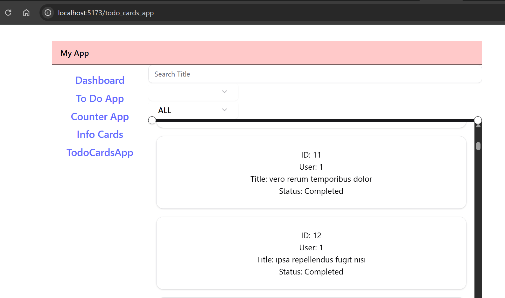

## Introduction

This application is focussed on learning React, TypeScript, Tailwind & shadcn by building simple applications.
In this application I have tested React concepts like `useState`, `useReducer`, `useEffect` by building simple counter app & a todo list visualizer.

Future Learning -
- Need to focus more on the css part since I couldnt control the layout of the application.

Data source was downloaded from [website](https://jsonplaceholder.typicode.com/todos) and an offline copy was saved into the public folder as [todo.json](/public/todos.json)

